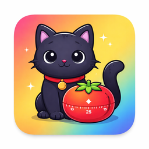

<p align="center">

<p>
 
<h1 align="center">Purromodoro</h1>

## Overview
A cat-themed <a href="https://en.wikipedia.org/wiki/Pomodoro_Technique">Pomodoro</a> timer for the macOS menu bar. Configurable work and rest intervals, optional sounds, discreet actionable notifications, and a global hotkey — all with cute cat icons that change based on your timer state.

Purromodoro is fully sandboxed with no entitlements.

Based on <a href="https://github.com/ivoronin/TomatoBar">TomatoBar</a> by Ilya Voronin.

## Installation
Download the latest release from the <a href="https://github.com/brianmat99/Purromodoro/releases/latest/">Releases page</a>.

After unzipping, remove the quarantine attribute before opening:
```
xattr -cr Purromodoro.app
```
Then move it to `/Applications` and open it.

## Integration with other tools
### Event log
Purromodoro logs state transitions in JSON format to `~/Library/Containers/com.github.brianmatamet.Purromodoro/Data/Library/Caches/Purromodoro.log`. Use this data to analyze your productivity and enrich other data sources.
### Starting and stopping the timer
Purromodoro can be controlled using `purromodoro://` URLs. To start or stop the timer from the command line, use `open purromodoro://startStop`.

## Licenses
 - Timer sounds are licensed from buddhabeats
